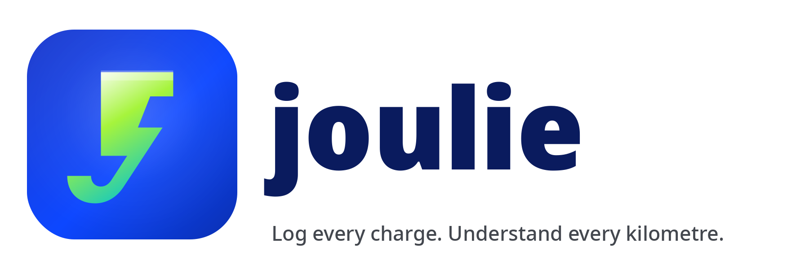

<p align="center">
  <picture>
    <source media="(prefers-color-scheme: dark)" srcset="docs/branding/joulie_logo_dark.png" />
    
  </picture>
</p>

# Joulie

> **Log every charge. Understand every kilometre.**

[](LICENSE)
[](https://github.com/SPS-L/joulie/releases/latest)
[](https://github.com/SPS-L/joulie/actions/workflows/ci.yml)
[](https://github.com/SPS-L/joulie/actions/workflows/release.yml)
[](https://developer.android.com/about/versions/oreo)
[](https://kotlinlang.org)

Track EV charging sessions, efficiency, cost, and CO₂, one joule at a time. Built and maintained by the [Sustainable Power Systems Lab (SPS-Lab)](https://sps-lab.org/) at Cyprus University of Technology.

🌐 **Live site:** [sps-l.github.io/joulie](https://sps-l.github.io/joulie/)

## About

Joulie is a clean, no-nonsense Android app for electric vehicle drivers who want to know exactly how their car uses energy. Log each charge and Joulie tracks the numbers that actually matter.

**What you log per charge:**

- Odometer reading, kWh added, AC or DC session
- Location (quick-chips or free text), and optional cost
- State-of-charge percentages, if your charger only shows %, Joulie does the kWh math for you

**What Joulie shows you:**

- Efficiency in km/kWh, kWh/100 km, or mi/kWh across any time period
- Cost per km or per 100 km, with mixed-currency warnings when relevant
- AC vs DC breakdown charts, monthly kWh and cost trends, and battery degradation over time
- CO₂ emissions versus a petrol-car baseline, using the Cyprus 2025 grid average by default (configurable)

**Other features:**

- Multi-car support with a top-bar switcher
- Home-screen widget showing your last charge at a glance
- Optional Google Drive backup (opt-in, stored in your private App Data folder only)
- CSV export via the standard Android share sheet
- Material 3 theming with light, dark, and system modes
- Available in English, Greek, Turkish, and Russian

**Privacy by design.** No analytics, no telemetry, no crash reporting. Your charge data stays on your device unless you explicitly enable Drive backup.

> *Drive smart. Charge logged. Every joule counted.*

## Download

Signed release APKs are attached to every GitHub Release: see the [Releases page](https://github.com/SPS-L/joulie/releases).

```bash
adb install joulie-v1.9.13.apk
```

You can also open the APK on the device after enabling **Install from unknown sources** for your file manager or browser.

## Privacy

- The app does not collect analytics, telemetry, or crash reports.
- All charge data is stored locally in the app's private Room database.
- Google Drive backup is **opt-in**. When enabled, a JSON snapshot is written to the app's private **App Data folder** on your Drive, hidden from the Drive UI and accessible only to this app's signing certificate. The scope is `https://www.googleapis.com/auth/drive.appdata`, the app cannot read or modify any other files on your Drive.
- CSV export writes to the app's external-files directory and is shared only via the Android share sheet at your request.

Full policy: [`PRIVACY.md`](PRIVACY.md), or live at [sps-l.github.io/joulie/privacy](https://sps-l.github.io/joulie/privacy).

## License

Released under the **GNU General Public License v3.0 or later** ([`GPL-3.0-or-later`](LICENSE)). © 2024–2026 [Sustainable Power Systems Lab (SPS-Lab)](https://sps-lab.org/), Cyprus University of Technology.

This program is free software: you can redistribute it and/or modify it under the terms of the GNU General Public License as published by the Free Software Foundation, either version 3 of the License, or (at your option) any later version. It is distributed in the hope that it will be useful, but WITHOUT ANY WARRANTY; without even the implied warranty of MERCHANTABILITY or FITNESS FOR A PARTICULAR PURPOSE. See the [LICENSE](LICENSE) file for the full text.

---

Building from source, running tests, or contributing? See [`CONTRIBUTING.md`](CONTRIBUTING.md).
